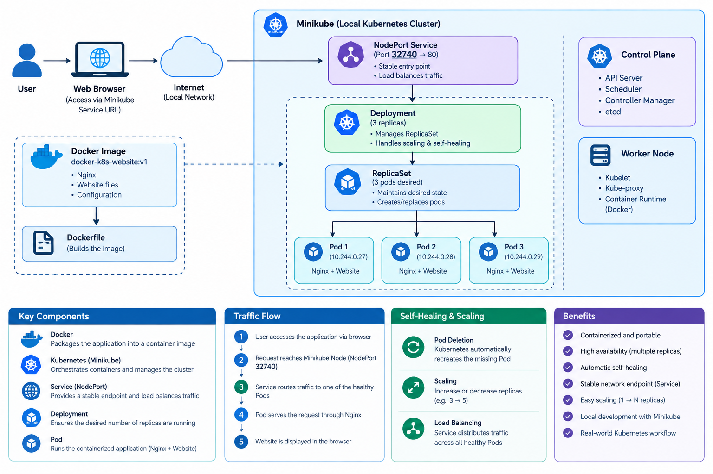

# Docker + Kubernetes --- Containerized Web Application

> A containerized static website deployed on a local Kubernetes cluster
> using Docker, Nginx, and Minikube. The project demonstrates Kubernetes
> Deployments, multiple replicas, Services, self-healing, and
> application scaling.

------------------------------------------------------------------------

## Architecture



------------------------------------------------------------------------

## Application Flow

``` text
Developer
    │
    ▼
HTML / CSS / JavaScript
    │
    ▼
Docker Build
    │
    ▼
Docker Image
docker-k8s-website:v1
    │
    ▼
Minikube
    │
    ▼
Kubernetes Deployment
    │
    ▼
ReplicaSet
    │
    ├──────────────┬──────────────┐
    ▼              ▼              ▼
  Pod 1          Pod 2          Pod 3
    │              │              │
    ▼              ▼              ▼
 Nginx            Nginx          Nginx
    │              │              │
    └──────────────┴──────────────┘
                   │
                   ▼
        Kubernetes NodePort Service
                   │
                   ▼
              Web Browser
```

------------------------------------------------------------------------

## Kubernetes Flow

``` text
User requests website
        │
        ▼
NodePort Service
        │
        ▼
Service selects Pods using label
app=docker-k8s-website
        │
        ├──────────────┬──────────────┐
        ▼              ▼              ▼
      Pod 1          Pod 2          Pod 3
        │              │              │
        ▼              ▼              ▼
      Nginx           Nginx          Nginx
        │              │              │
        ▼              ▼              ▼
     Website        Website        Website
```

------------------------------------------------------------------------

## Features

**Static Website** - HTML5, CSS3, and Vanilla JavaScript - Simple
interactive website - Served using Nginx - Lightweight application
suitable for containerization

**Docker** - Custom Docker image built from an Nginx Alpine base image -
Website files copied into the Nginx web root - Port 80 exposed inside
the container - Local container testing using host port 8081

**Kubernetes** - Deployment manages the application Pods - Three
replicas provide multiple running instances - Kubernetes Service
provides a stable access point - NodePort exposes the application
outside the cluster - Service automatically discovers matching Pods
using labels - Demonstrates Pod self-healing - Demonstrates horizontal
scaling by changing replica count - Rolling updates are handled by the
Deployment

------------------------------------------------------------------------

## Tech Stack

  Layer              Technology
  ------------------ ---------------------------------
  Frontend           HTML5, CSS3, Vanilla JavaScript
  Web Server         Nginx
  Containerization   Docker
  Container Image    Docker Image
  Orchestration      Kubernetes
  Local Kubernetes   Minikube
  Kubernetes CLI     kubectl
  Source Control     Git, GitHub
  Operating System   Windows

------------------------------------------------------------------------

## Project Structure

``` text
docker-k8s-project/
├── index.html                 # Main website page
├── style.css                  # Website styling
├── script.js                  # Website interaction
├── Dockerfile                 # Docker image build instructions
├── k8s/
│   ├── deployment.yaml        # Kubernetes Deployment configuration
│   └── service.yaml            # Kubernetes NodePort Service
├── docs/
│   └── architecture.png       # Architecture diagram
└── README.md
```

------------------------------------------------------------------------

## Dockerfile Explained

``` dockerfile
# Lightweight Nginx image
FROM nginx:alpine

# Copy website files into Nginx web root
COPY . /usr/share/nginx/html

# Nginx listens on port 80
EXPOSE 80
```

The Dockerfile creates a lightweight Nginx container and copies the
static website files into `/usr/share/nginx/html`, which is the default
Nginx web directory.

------------------------------------------------------------------------

## Kubernetes Deployment Explained

``` yaml
apiVersion: apps/v1
kind: Deployment

metadata:
  name: docker-k8s-website

spec:
  replicas: 3

  selector:
    matchLabels:
      app: docker-k8s-website

  template:
    metadata:
      labels:
        app: docker-k8s-website

    spec:
      containers:
        - name: website
          image: docker-k8s-website:v1
          imagePullPolicy: Never
          ports:
            - containerPort: 80
```

### Important Configuration

  -----------------------------------------------------------------------
  Configuration                       Purpose
  ----------------------------------- -----------------------------------
  `Deployment`                        Manages the desired state of the
                                      application

  `replicas: 3`                       Keeps three Pods running

  `matchLabels`                       Connects the Deployment to its Pods

  `image`                             Specifies the Docker image

  `imagePullPolicy: Never`            Uses the image already available
                                      inside Minikube

  `containerPort: 80`                 Nginx listens on port 80
  -----------------------------------------------------------------------

------------------------------------------------------------------------

## Kubernetes Service Explained

``` yaml
apiVersion: v1
kind: Service

metadata:
  name: docker-k8s-website-service

spec:
  type: NodePort

  selector:
    app: docker-k8s-website

  ports:
    - port: 80
      targetPort: 80
```

The Service provides a stable network endpoint for the Pods.

The selector:

``` yaml
selector:
  app: docker-k8s-website
```

finds all Pods with the matching label.

The Service then routes traffic to the available Pods.

------------------------------------------------------------------------

## Setup and Deployment

### Prerequisites

Install the following:

-   Docker
-   Minikube
-   kubectl
-   Git
-   GitHub account

Verify the installations:

``` powershell
docker --version
minikube version
kubectl version --client
git --version
```

------------------------------------------------------------------------

## Step 1 --- Start Minikube

``` powershell
minikube start
```

Check the cluster:

``` powershell
kubectl get nodes
```

Expected result:

``` text
NAME       STATUS   ROLES           AGE   VERSION
minikube   Ready    control-plane   ...   v1.35.1
```

------------------------------------------------------------------------

## Step 2 --- Build the Docker Image

From the project root:

``` powershell
docker build -t docker-k8s-website:v1 .
```

Check the image:

``` powershell
docker images
```

------------------------------------------------------------------------

## Step 3 --- Test the Docker Container Locally

Run the container:

``` powershell
docker run -d -p 8081:80 --name docker-k8s-website docker-k8s-website:v1
```

Open:

``` text
http://localhost:8081
```

Port `8081` is used on the host while Nginx listens on port `80` inside
the container.

Stop and remove the test container when finished:

``` powershell
docker rm -f docker-k8s-website
```

------------------------------------------------------------------------

## Step 4 --- Load the Image into Minikube

``` powershell
minikube image load docker-k8s-website:v1
```

Verify:

``` powershell
minikube image ls | Select-String "docker-k8s-website"
```

Expected:

``` text
docker.io/library/docker-k8s-website:v1
```

------------------------------------------------------------------------

## Step 5 --- Deploy the Application

Apply the Deployment:

``` powershell
kubectl apply -f k8s/deployment.yaml
```

Check the Deployment:

``` powershell
kubectl get deployments
```

Check the Pods:

``` powershell
kubectl get pods
```

Expected:

``` text
docker-k8s-website-xxxxx   1/1   Running
docker-k8s-website-xxxxx   1/1   Running
docker-k8s-website-xxxxx   1/1   Running
```

------------------------------------------------------------------------

## Step 6 --- Create the Kubernetes Service

``` powershell
kubectl apply -f k8s/service.yaml
```

Check the Service:

``` powershell
kubectl get services
```

Example:

``` text
NAME                       TYPE       CLUSTER-IP      PORT(S)
docker-k8s-website-service NodePort   10.x.x.x        80:32740/TCP
```

Here:

``` text
80     → Service port
32740  → NodePort
80     → Pod targetPort
```

------------------------------------------------------------------------

## Step 7 --- Access the Website

The easiest way to access the NodePort Service with Minikube is:

``` powershell
minikube service docker-k8s-website-service --url
```

Open the URL displayed by Minikube in your browser.

------------------------------------------------------------------------

## Testing Kubernetes

### Check Pods

``` powershell
kubectl get pods
```

### Check Deployment

``` powershell
kubectl get deployment docker-k8s-website
```

### Check Service

``` powershell
kubectl get service docker-k8s-website-service
```

### Check EndpointSlices

``` powershell
kubectl get endpointslice
```

EndpointSlices show the Pod endpoints currently associated with the
Service.

------------------------------------------------------------------------

## Self-Healing Demonstration

Kubernetes automatically maintains the desired number of replicas.

First check the Pods:

``` powershell
kubectl get pods
```

Delete one application Pod:

``` powershell
kubectl delete pod <pod-name>
```

Immediately check:

``` powershell
kubectl get pods
```

Kubernetes detects that the number of running Pods is below the desired
state and creates a replacement Pod.

This demonstrates Kubernetes self-healing.

------------------------------------------------------------------------

## Scaling Demonstration

The Deployment currently uses:

``` yaml
replicas: 3
```

Scale the application to five replicas:

``` powershell
kubectl scale deployment docker-k8s-website --replicas=5
```

Check:

``` powershell
kubectl get pods
```

You should now have five running Pods.

Check the Deployment:

``` powershell
kubectl get deployment docker-k8s-website
```

Scale back to three:

``` powershell
kubectl scale deployment docker-k8s-website --replicas=3
```

------------------------------------------------------------------------

## Updating the Website

When changing `index.html`, `style.css`, or `script.js`, create a new
Docker image version.

For example:

``` powershell
docker build -t docker-k8s-website:v2 .
```

Load it into Minikube:

``` powershell
minikube image load docker-k8s-website:v2
```

Update `k8s/deployment.yaml`:

``` yaml
image: docker-k8s-website:v2
```

Apply the updated Deployment:

``` powershell
kubectl apply -f k8s/deployment.yaml
```

Check the rollout:

``` powershell
kubectl rollout status deployment/docker-k8s-website
```

Check the Pods:

``` powershell
kubectl get pods
```

The Deployment performs a rolling update from the old image to the new
image.

------------------------------------------------------------------------

## GitHub Workflow

After making changes:

``` powershell
git add .
git commit -m "Update website"
git push origin main
```

The GitHub repository contains the source code, Dockerfile, and
Kubernetes manifests required to recreate the project.

------------------------------------------------------------------------

## Useful Kubernetes Commands

### Cluster

``` powershell
minikube status
kubectl get nodes
```

### Deployments

``` powershell
kubectl get deployments
kubectl describe deployment docker-k8s-website
```

### Pods

``` powershell
kubectl get pods
kubectl describe pod <pod-name>
kubectl logs <pod-name>
```

### Services

``` powershell
kubectl get services
kubectl describe service docker-k8s-website-service
```

### EndpointSlices

``` powershell
kubectl get endpointslice
```

### Scaling

``` powershell
kubectl scale deployment docker-k8s-website --replicas=5
```

### Rollout

``` powershell
kubectl rollout status deployment/docker-k8s-website
kubectl rollout history deployment/docker-k8s-website
```

------------------------------------------------------------------------

## Key Concepts Demonstrated

-   Static website containerization
-   Docker image creation
-   Nginx as a lightweight web server
-   Kubernetes cluster with Minikube
-   Kubernetes Deployment
-   ReplicaSet management
-   Multiple Pod replicas
-   Kubernetes Service
-   NodePort networking
-   Label-based Pod selection
-   Service endpoint discovery
-   Kubernetes self-healing
-   Horizontal scaling
-   Rolling updates
-   Local container testing
-   Git and GitHub version control

------------------------------------------------------------------------

